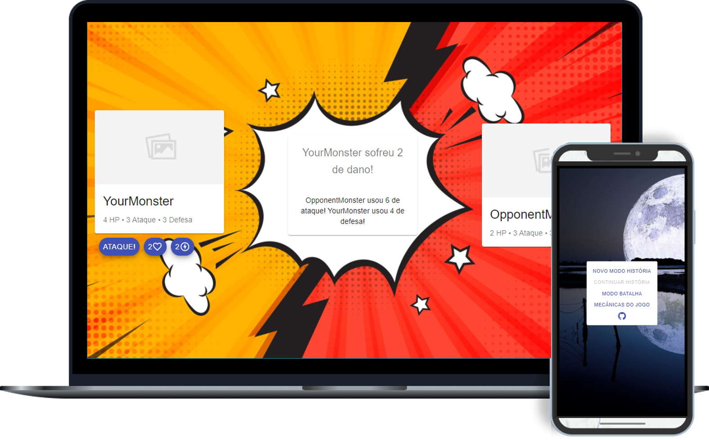

<h1 align="center">
    React Battle Rpg
</h1>

<p align="center">
  

  

  
</p>



## 🎮 O Jogo

É um pequeno jogo de batalhas por turnos escrito em ReactJS. Criado para colocar em prática o conhecimento obtido com a biblioteca até o momento através de um projeto pessoal.

Possui:

- Modo História (com três finais possíveis: ruim, bom e secreto);
- Modo Treino;
- Ranking mostrando a pontuação obtida no modo história.

Para conhecer e jogar, acesse: https://react-battle-rpg.web.app/.

(As telas são responsivas, portanto, sinta-se a vontade para jogar em qualquer dispositivo).

## 🧪 Tecnologias

Este projeto foi desenvolvido utilizando as seguintes tecnologias:

- [React](https://reactjs.org)
- [TypeScript](https://www.typescriptlang.org/)
- [Firebase](https://firebase.google.com/)
- [Material-UI](https://material-ui.com/)
- [Material-UI Icons](https://material-ui.com/pt/components/icons/)
- [Mui-Datatable](https://github.com/gregnb/mui-datatables)
- [Js-Cookie](https://github.com/js-cookie/js-cookie)

## 🚀 Iniciando localmente em seu PC

O projeto utiliza autenticação do google e banco de dados pelo firebase, ambos para armazenar a pontuação dos jogadores do modo história e exibi-la em um [ranking](https://react-battle-rpg.web.app/ranking). Você deve configurar o firebase para usar todos os recursos atuais do projeto ou utilizar a [versão 1.2.0 beta](https://github.com/gonribeiro/React-Battle-Rpg/releases/tag/v1.2.0-beta) (Esta antiga versão pode ser executada seguindo apenas os passos abaixo).

Clone o projeto e acesse a pasta.

```bash
$ git clone https://github.com/gonribeiro/React-Battle-Rpg
$ cd React-Battle-Rpg
```

Siga os passos abaixo:
```bash
# Instale as dependências
$ yarn
# Inicie o projeto
$ yarn start
```
O aplicativo estará disponível para acesso em seu navegador em http://localhost:3000

## 📝 Licença

Este projeto está licenciado sob a Licença MIT. Veja o arquivo de [LICENÇA](LICENSE.md) para detalhes

---
<p align="center">História e Jogo criado por 💜 Tiago Ribeiro</p>