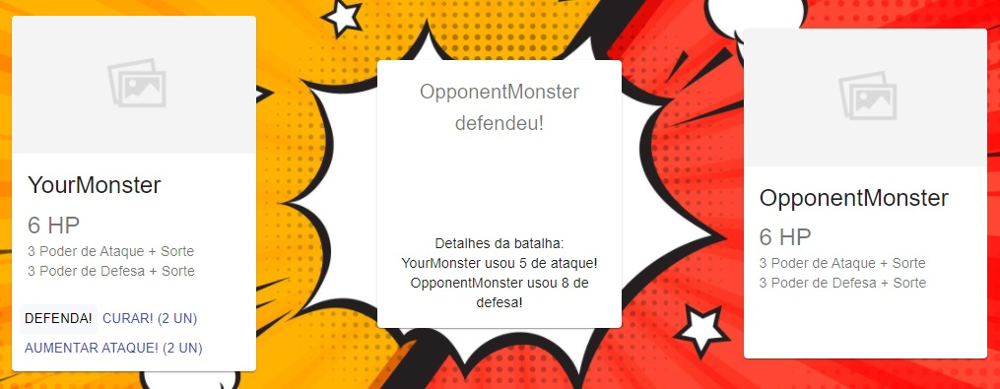

# Projeto

## https://react-battle-monster.herokuapp.com/

# Projeto

- yarn create react-app . --template typescript
- yarn add react-router-dom
- yarn add @types/react-router-dom
- yarn add @material-ui/core
- yarn add @types/material-ui
- yarn add @material-ui/icons
- yarn add js-cookie
- yarn add @types/js-cookie -D

# Tarefas

[x] Mecânica de Batalhas  
[x] Quadros de exibição das informações das batalhas   
[x] Lista de personagens  
[x] Items  
[x] Batalhas em sequencia  
[x] Condições de vitórias e derrotas  
[x] Informações das mecânicas do jogo  
[x] Créditos  
[ ] História  
[ ] Quadros da história  
[ ] Efeitos de transição entre as histórias e batalhas  
[ ] Sons  
[x] Rever design de telas  
[x] Melhorar textos de mecânicas do jogo  
[ ] <s>Instrução para deitar o celular quando acessando por um smartphone</s> 
[ ] <s>Testes</s>  